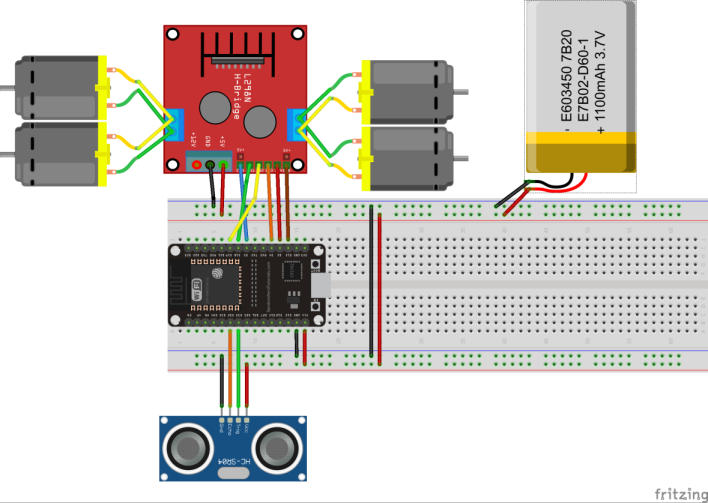
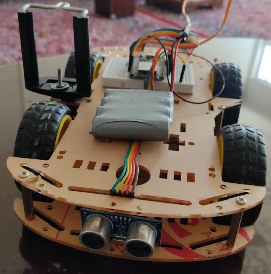
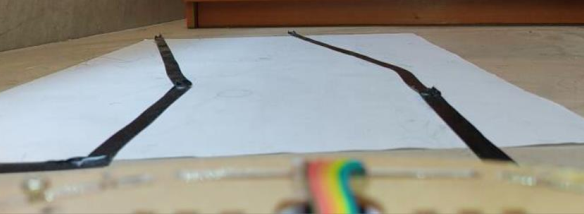
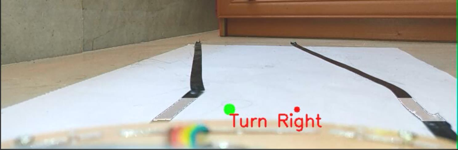
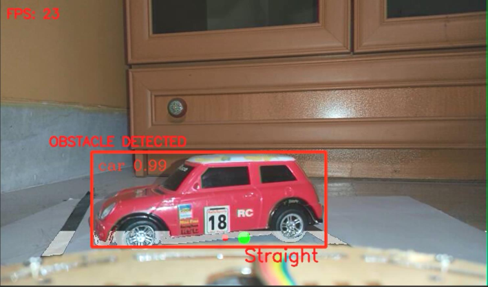
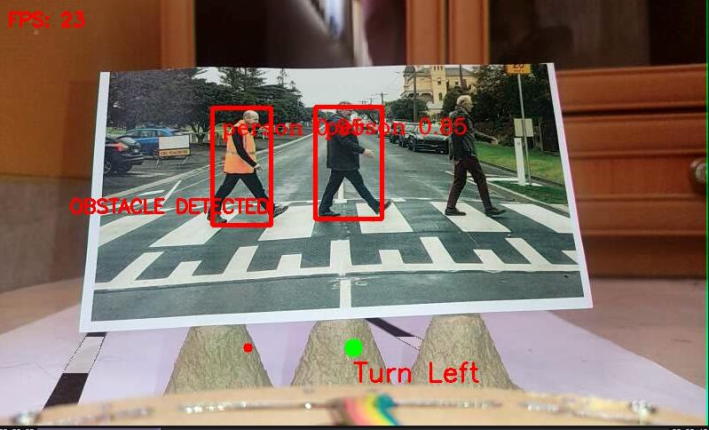
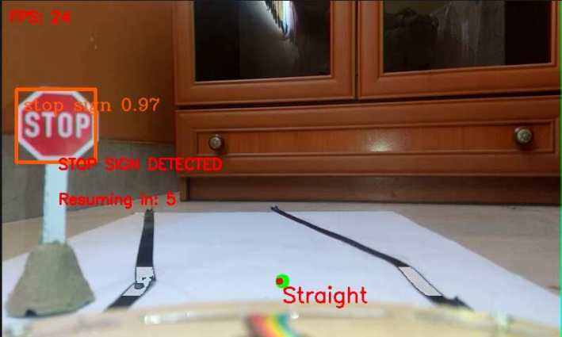

# Remote Car Robot Controller Using Object Detection and Computer Vision

This repository contains the implementation for my thesis:

**Thesis:** Building a Mobile Robot and Controlling its Navigation Using Computer Vision and Machine Learning Based on Environmental Circumstances  
**Student:** Alireza Saviz  
**Supervisor:** [Dr. Alireza Yazdizadeh](https://scholar.google.com/citations?user=vmyY_5kAAAAJ&hl=en)  
**Score:** 20/20 (A+)

---

## How to Run This Code

To execute the code in this repository, follow these steps:

### 1. Build the Robot Car

#### Components Used

- Robot car chassis with 4 geared motors
- ESP32 WiFi/Bluetooth module
- L298N motor driver
- SRF05 ultrasonic sensor
- Rechargeable battery
- Mobile phone holder
- Android smartphone
- Breadboard and jumper cables

#### Assembly Instructions

1. Assemble the chassis and components as per the provided circuit diagram:
   
2. The final assembled robot should resemble the following:
   

---

### 2. Load Code onto the ESP32 Module

1. Install the Arduino IDE (if not already installed).
2. Update the ESP32 code located at `/Car.lnk/Car.lnk.ino` with your router or mobile hotspot’s SSID and password.
3. Flash the updated code to the ESP32 module.
4. Note the IP address assigned to the ESP32 module. This will be used in the `main.py` file.

---

### 3. Install the IP Webcam App

1. Download and install the [IP Webcam App](https://play.google.com/store/apps/details?id=com.pas.webcam) on your Android smartphone.
2. Run the app and note the IP address displayed. Enter this IP address in the `main.py` file.

*Ensure that your laptop, smartphone, and ESP32 module are connected to the same network with strong signal strength.*

---

### 4. Create a Test Environment

Prepare a test environment to optimize the code parameters for smooth navigation. For example:

- Use black electrical tape on white paper to create lanes for the robot.

Example test environment:  

---

### 5. Download and Optimize the Object Detection Model

1. Use the notebook in the `utils` directory to download and optimize the object detection model.
2. The model is based on OpenVINO. Refer to the [OpenVINO documentation](https://docs.openvino.ai/latest/notebooks/401-object-detection-with-output.html) for detailed instructions.

---

### 6. Adjust Code Parameters

1. Update the IP addresses (from the ESP32 and IP Webcam app) in the `main.py` file.
2. Run the `main.py` script. It will display video feed from your smartphone along with debug texts and commands.
3. Fine-tune the following parameters in the `LaneDetection` class:
   - `high_tresh` and `low_tresh`: Adjust the detection window for lane detection.
   - `black_threshold`: Modify this based on lighting and lane colors. Higher values increase the brightness range for detection.
4. Test and refine these parameters until the detection results are reliable.

---

### 7. Execute the Code

1. Once all parameters are optimized, run the `main.py` script.
2. Press the **space bar** to initiate the car’s movement. The robot will:
   - Detect lanes for navigation.
   - Identify and respond to obstacles such as cars, pedestrians, and stop signs.

---

## Results

Below are sample outputs showcasing obstacle and lane detection:

1. Obstacle detection while running:
   

2. Turning right:
   

3. Car detection:
   

4. Person detection:
   

5. Stop sign detection:
   

---

## References

1. [OpenVINO Object Detection Documentation](https://docs.openvino.ai/latest/notebooks/401-object-detection-with-output.html)
2. Aminuddin et al., "A new approach to highway lane detection by using Hough transform technique," *Journal of Information and Communication Technology*, vol. 16, no. 2, pp. 244-260, 2017.
3. [ESP8266 Ultrasonic Sensor Tutorial](https://randomnerdtutorials.com/esp8266-nodemcu-hc-sr04-ultrasonic-arduino)
4. [OpenVINO Model Zoo - SSDLite MobileNet V2](https://github.com/openvinotoolkit/open_model_zoo/tree/master/models/public/ssdlite_mobilenet_v2)
